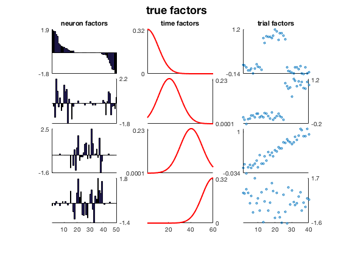
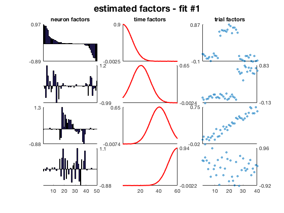
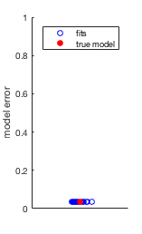

# A Short Tutorial on Tensor Decompositions and Multi-Trial Neural Data

[Alex H. Williams](http://alexhwilliams.info)

This is a short and self-contained example that illustrates how to fit [canonical polyadic (CP) tensor decompositions](https://en.wikipedia.org/wiki/Tensor_rank_decomposition) to multi-trial neural data.

### Background

A very common and generic experimental design in neuroscience is to record the activity of many neurons across repeated behavioral trials. Let's say we record the activity of `N` neurons at `T` time points in each trial, and that there are `K` total trials. A natural way to represent this data is a three-dimensional data array with dimensions `N x T x K`. Higher-order arrays like this are called *tensors*.

We would like to find a compact and interpretable description of this multi-trial dataset. This goal is often called *dimensionality reduction*, and involves reducing the measured dimensionality of the data (which can easily involve hundreds of neurons, and hundreds of trials given current experimental technologies) to a handful of latent *factors*. Principal Components Analysis (PCA) is a classic technique for dimensionality reduction ([*click here for a shameless plug*](http://alexhwilliams.info/itsneuronalblog/2016/03/27/pca/)).

CP decomposition extends PCA to higher-order tensors. In fact, PCA ***is*** CP decomposition on a matrix (i.e. a second-order tensor). As described above, multi-trial data is naturally represented as a third-order tensor. Applying CP decomposition to this tensor produces low-dimensional factors for within-trial as well as across-trial changes in neural activity.

CP decomposition is an attractive technique both because it is conceptually simple (each trial is modeled as a linear combination of latent factors) and because it has some subtle advantages (the optimal model is unique, whereas the factors identified by PCA can be rotated arbitrarily without affecting reconstruction error).

**More background reading:**

* [An abstract I submitted to Cosyne 2017](http://alexhwilliams.info)
  * *contains some illustrative results on to two experimental datasets*
* [Some notes on PCA, CP decomposition, and Demixed PCA](http://alexhwilliams.info)
  * *contains math*
* [Bader & Kolda (2009). Tensor Decompositions and Applications. *SIAM Review*.](http://www.sandia.gov/~tgkolda/pubs/pubfiles/TensorReview.pdf)
  * *a very popular general and technical review of tensor decompositions*

### Quickstart (MATLAB)

First, download the latest version of the MATLAB [TensorToolbox](http://www.sandia.gov/~tgkolda/TensorToolbox/) developed at Sandia National Laboratories by [Tammy Kolda](http://www.sandia.gov/~tgkolda/) and collaborators. Add it somewhere on your [MATLAB path](https://www.mathworks.com/help/matlab/ref/path.html).

Then, either download this github repo as a zip file, or clone it from the command line:

```
$  git clone https://github.com/ahwillia/tensor-demo.git
```

Open MATLAB and navigate the folder containing this code and run the script `cp_neuron_demo` to generate some synthetic data and fit a third-order CP decomposition.

You can play with various parameters/settings on the synthetic data. As long as noise is low enough, the CP decomposition (fit by alternating least-squares, as reviewed in [Kolda & Bader](http://www.sandia.gov/~tgkolda/pubs/pubfiles/TensorReview.pdf)) should do a pretty good job of estimating the true latent factors:





Unlike PCA, CP decomposition cannot be solved in closed form -- instead, the model parameters are optimized from an initial guess. Thus, it is good practice to fit the model from multiple initial conditions, and verify that the final solution isn't too sensitive to this guess. Again, when noise is low enough this is the case for this dataset; the dotplot below shows the reconstruction error for 30 model fits (blue) and the reconstruction error for the true latent factors (red):



In certain scenarios (try playing with `lam` so that some factors are more significant than others) the synthetic data is harder to fit. In the plot below, a lot of fits get stuck in suboptimal local minima (though the correct factors are still recovered after starting from enough initial conditions!):


### Contact / Future Work

I'm actively working on extensions and refinements to CP decomposition for my PhD thesis. [Get in touch](http://alexhwilliams.info) if you want to discuss specifics. I'm working on:

* Generalizing CP decomposition to accomodate different loss functions and regularization choices (e.g. constraining factors to be sparse, smooth, non-negative)
* Better tools in Python / Julia
* Incorporating time-warping into PCA and tensor decompositions in collaboration with [@nirum](http://niru.org/) and [@poolio](http://cs.stanford.edu/~poole/)
  * [*described in more detail here*](alexhwilliams.info/pdf/warptour_cosyne.pdf)
